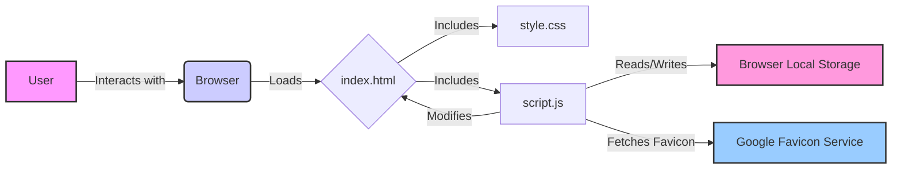

# Application Architecture

This document outlines the architecture, components, and data flow of the Awesome Kartikey Book Keeper application.

## 1. System Architecture Overview

Awesome Kartikey Book Keeper is a **client-side, single-page application (SPA)**. It runs entirely within the user's web browser.

- **Frontend Only**: There is no backend server component. All logic (UI, data handling, storage) resides in the browser.
- **Data Storage**: Uses the browser's **Local Storage API** for data persistence. Bookmarks are stored locally on the user's machine within the specific browser profile.
- **Rendering**: Dynamically renders and updates the bookmark list using JavaScript DOM manipulation.



## 2. Project Folder Structure

The project has a minimal and flat structure:

```
book-keeper/
│
├── index.html        # Main HTML file (Structure and Entry Point)
├── script.js         # JavaScript file (Application Logic and Interactivity)
└── style.css         # CSS file (Styling and Presentation)
```

- `index.html`: Defines the static structure of the page, including the "Add Bookmark" button, the container for displaying bookmarks (`#bookmarks-container`), and the modal dialog (`#modal`) with its form (`#bookmark-form`). It links to the CSS and JS files.
- `script.js`: Contains all the JavaScript code responsible for handling user interactions (showing/hiding the modal, form submission, deleting bookmarks), validating input, interacting with Local Storage, and dynamically generating the HTML for the bookmark list.
- `style.css`: Contains all the CSS rules for styling the HTML elements, including layout, colors, fonts, modal appearance, animations, and basic responsiveness.

## 3. Major Components

- **UI View (`index.html`, `style.css`)**:
  - Provides the visual elements users interact with.
  - Includes the main button, the bookmark display area, and the modal form.
  - Styled using `style.css` for appearance and layout.
- **Application Logic (`script.js`)**:
  - **Modal Manager**: Handles showing and hiding the "Add Bookmark" modal. Listens for clicks on the trigger button, close button, and outside the modal area.
  - **Form Handler**: Listens for the submission of the bookmark form. Prevents default submission, retrieves input values, validates them, and triggers the storage process.
  - **Bookmark Manager**:
    - `bookmarks` array: In-memory store for the bookmark objects.
    - `fetchBookmarks()`: Loads bookmarks from Local Storage into the `bookmarks` array on page load. Creates default bookmarks if none exist.
    - `storeBookmark()`: Adds a new bookmark object to the `bookmarks` array and updates Local Storage.
    - `deleteBookmark(url)`: Removes a bookmark from the `bookmarks` array based on its URL and updates Local Storage.
    - `buildBookmarks()`: Renders the current state of the `bookmarks` array into the DOM, creating HTML elements for each bookmark dynamically.
  - **Validation Logic**: `validate()` function checks if name/URL are provided and if the URL matches a basic regex pattern.
  - **Persistence Layer (Interaction with Local Storage)**: Uses `localStorage.getItem('bookmarks')` to retrieve, `localStorage.setItem('bookmarks', JSON.stringify(bookmarks))` to save, and `JSON.parse()` to convert the stored string back into an array.
- **External Services**:
  - **Google Favicon Service**: Used indirectly via `` tags to fetch favicons based on bookmark URLs.

## 4. Data Flow

**A. Application Load:**

1.  User opens `index.html`.
2.  `script.js` executes.
3.  `fetchBookmarks()` is called.
4.  Script attempts to read `'bookmarks'` key from Local Storage.
    - **If data exists**: `JSON.parse()` converts the stored string into the `bookmarks` array.
    - **If no data exists**: A default `bookmarks` array is created, and `JSON.stringify()` is used to save it to Local Storage.
5.  `buildBookmarks()` is called.
6.  It iterates through the `bookmarks` array.
7.  For each bookmark, it creates DOM elements (`div.item`, `i.fa-times`, `div.name`, `img` (favicon), `a` (link)) and appends them to the `#bookmarks-container`. Favicon `src` attribute points to Google's service.
8.  The UI displays the saved or default bookmarks.

**B. Adding a Bookmark:**

1.  User clicks "Add Bookmark" (`#show-modal`).
2.  `showModal()` function adds `show-modal` class to `#modal`, making it visible. Sets focus on the name input.
3.  User fills the form (`#bookmark-form`) and clicks "Save".
4.  `submit` event listener on the form calls `storeBookmark(e)`.
5.  `e.preventDefault()` stops the default form submission.
6.  Input values (name, URL) are retrieved. URL is potentially prefixed with `https://`.
7.  `validate(name, url)` is called. If invalid, shows an alert and stops.
8.  A new bookmark object `{ name, url }` is created.
9.  The new object is pushed into the `bookmarks` array.
10. `JSON.stringify()` converts the updated `bookmarks` array to a string.
11. `localStorage.setItem()` saves the updated string to Local Storage.
12. `fetchBookmarks()` is called again to refresh the UI based on the latest data in Local Storage (although `buildBookmarks()` could be called directly here for efficiency).
13. The form is reset (`bookmarkForm.reset()`), and focus returns to the name input.
14. The modal remains open (user needs to close it manually or click outside).

**C. Deleting a Bookmark:**

1.  User clicks the 'x' icon (`i.fa-times`) on a bookmark item.
2.  The `onclick` attribute triggers `deleteBookmark('bookmarkUrl')`.
3.  `deleteBookmark(url)` iterates through the `bookmarks` array.
4.  It finds the bookmark matching the `url` and removes it using `bookmarks.splice(i, 1)`.
5.  `JSON.stringify()` converts the modified `bookmarks` array to a string.
6.  `localStorage.setItem()` saves the updated string to Local Storage.
7.  `fetchBookmarks()` is called to re-render the UI, reflecting the deletion.

## 5. Design Decisions

- **Vanilla JavaScript**: Chosen for simplicity, performance in a small scope, and to avoid framework dependencies. It makes the project lightweight and good for learning core JS concepts.
- **Local Storage**: Selected as the persistence mechanism because it's built into browsers, easy to use, and sufficient for a client-only application storing a modest amount of non-sensitive data. Avoids the need for a backend.
- **Direct DOM Manipulation**: Instead of a virtual DOM or complex templating, the script directly creates and manipulates DOM elements (`createElement`, `append`, `textContent`). This is feasible for the limited scope of UI updates needed.
- **Single JS / CSS Files**: For a project of this size, splitting into multiple modules/components wasn't deemed necessary, keeping the structure simple.
- **Separate Delete Function with `onclick`**: Using an `onclick` attribute directly in the HTML generated by `buildBookmarks` is a simple way to pass the specific URL to the `deleteBookmark` function without complex event delegation setup for this scale.
- **Google Favicon Service**: An easy, zero-configuration way to display favicons without needing backend logic or complex frontend parsing. Relies on an external service.
